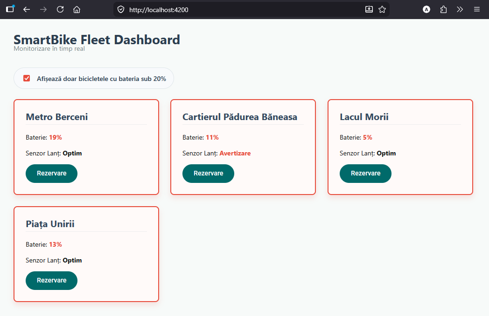
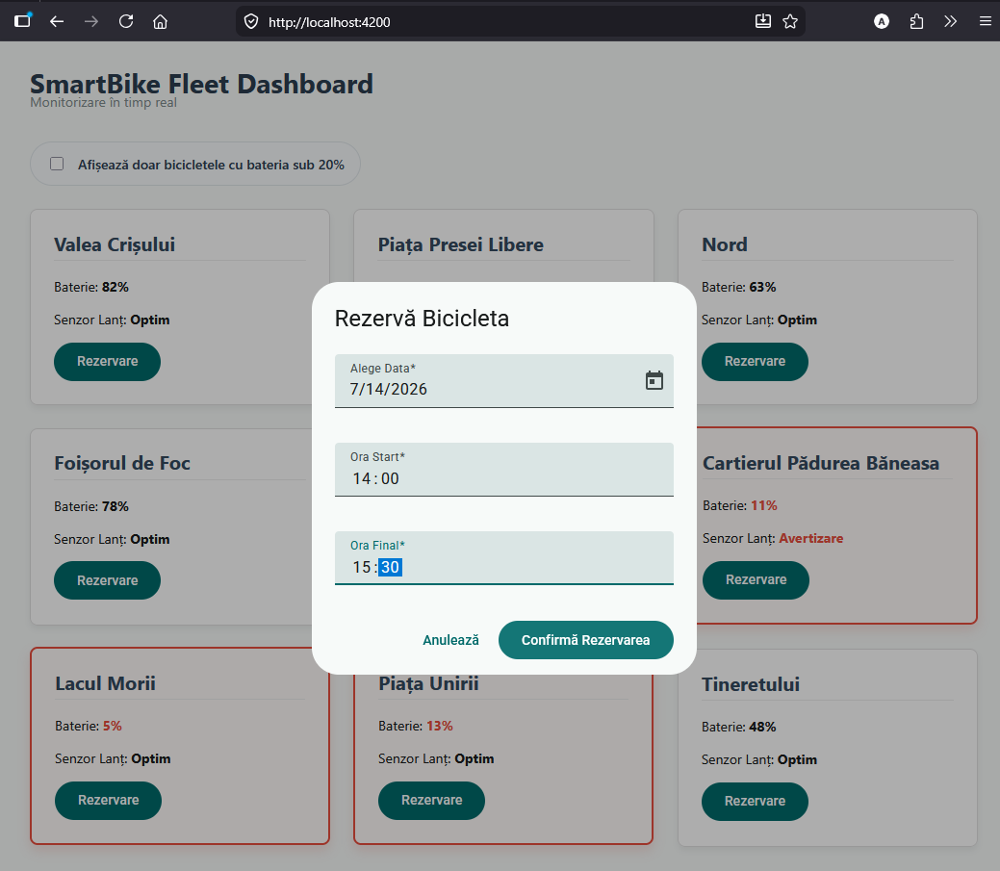
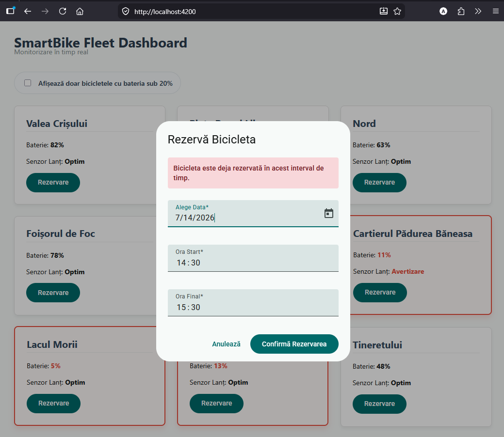

# SmartBike Tracker 🚲

A full-stack Proof of Concept (PoC) for real-time monitoring of a fleet of smart electric bikes. The project demonstrates the integration between a robust .NET API, based on Clean Architecture principles, a PostgreSQL relational database, and a reactive frontend built with Angular.

## 🌟 Features

* **Real-time Monitoring:** The dashboard retrieves updated fleet data every 5 seconds using RxJS polling.
* **Automated Alerts:** The interface reacts instantly and visually highlights (with red cards) bikes that require attention (e.g., battery level critically low at under 20% or a chain requiring maintenance).
* **Dynamic Filtering:** Easily toggle visibility to focus only on bikes needing an immediate charge using the low battery filter.
* **Smart Reservation System:** Built-in booking system with backend validation to prevent time-slot overlaps, featuring a responsive Angular Material dialog and comprehensive error handling.
* **Decoupled Architecture:** The backend is structured in layers (Domain, Application, Infrastructure, API) to allow for easy database changes without affecting the business logic.

## 📸 Screenshots

### Fleet Dashboard (Normal Status)


### Triggering a Telemetry Alert


### Dynamic Filtering (low battery only)


### Booking a Bike (successful reservation)


### Booking Conflict (time overlap validation)


## 🛠️ Technologies Used

### Backend (.NET Core)
* C# & ASP.NET Core Web API
* Clean Architecture, Domain-Driven Design (DDD) & Dependency Injection
* Entity Framework Core (Code-First) & PostgreSQL
* CORS configured for communication with the frontend

### Frontend (Angular)
* Angular 17+ (Standalone Components, `@if` and `@for` control flow)
* Angular Material (Dialogs, Datepicker, Input components)
* RxJS (`BehaviorSubject`, `switchMap`, `timer` for polling)
* SCSS for a modern and responsive interface

## 📋 Prerequisites

This project was developed and tested on **Windows (win32 x64)** using the following tool versions:

* **.NET SDK:** 10.0.201
* **Node.js:** 24.18.0
* **npm:** 11.18.0
* **Angular CLI:** 22.0.4
* PostgreSQL & pgAdmin 4 (for database management)

Make sure you have these versions (or compatible later versions) installed before attempting to run the application.

## 🚀 How to Run the Project Locally

### 1. Database Setup
Ensure your PostgreSQL server is running. Update the connection string in `appsettings.json` if necessary, then apply the migrations:
```bash
cd SmartBikeTracker.Api
dotnet ef database update
```

### 2. Starting the Backend
Navigate to the API folder and run:
```bash
cd SmartBikeTracker.Api
dotnet run
```
The API will start at http://localhost:5009.

### 3. Starting the Frontend
In a separate terminal, navigate to the Angular application folder and run:

```bash
cd smart-bike-tracker-ui
npm install
ng serve
```
The application will be available at http://localhost:4200.