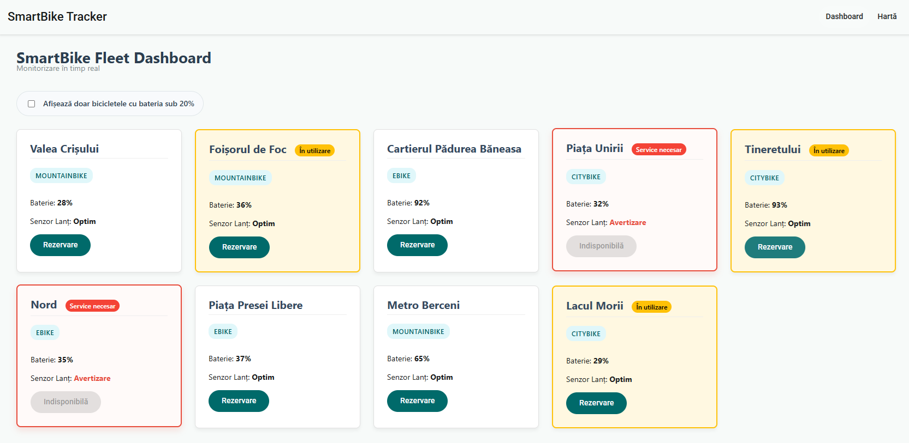
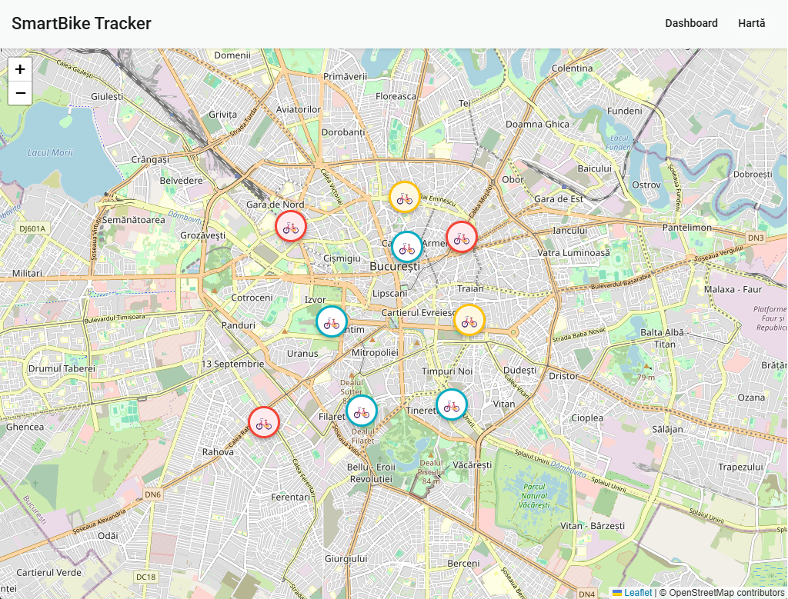
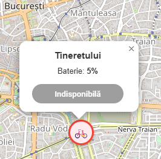
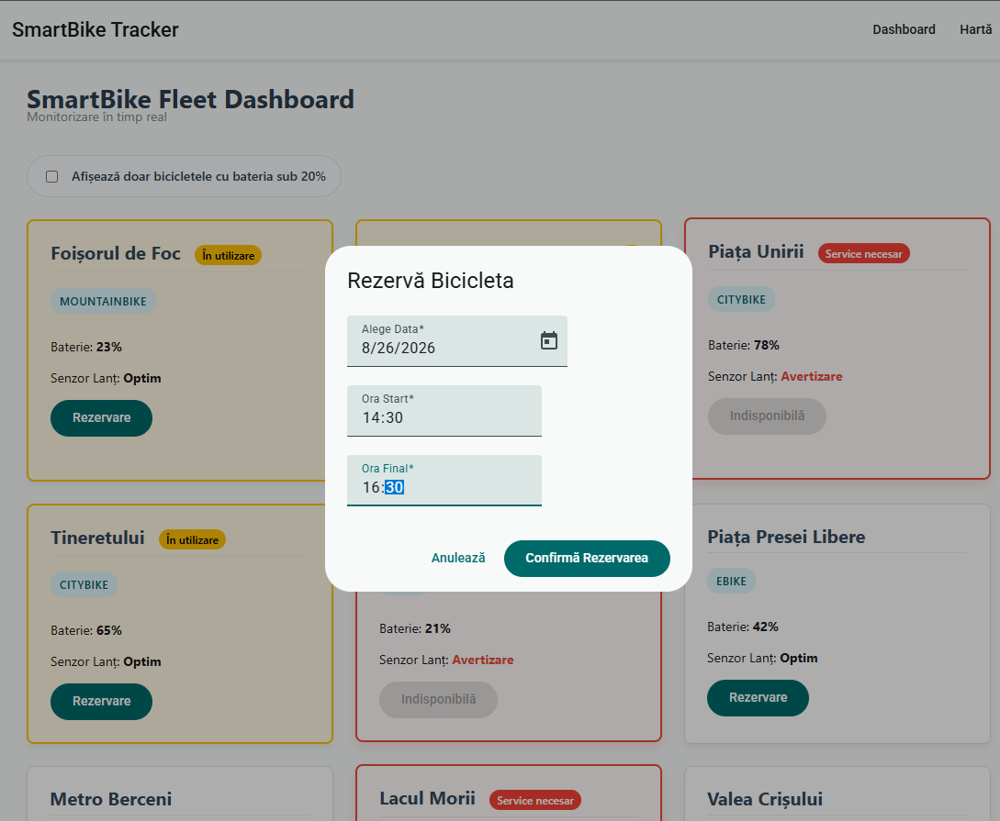
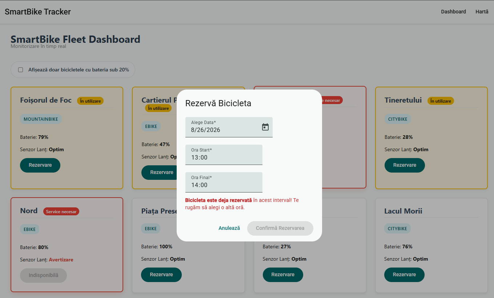
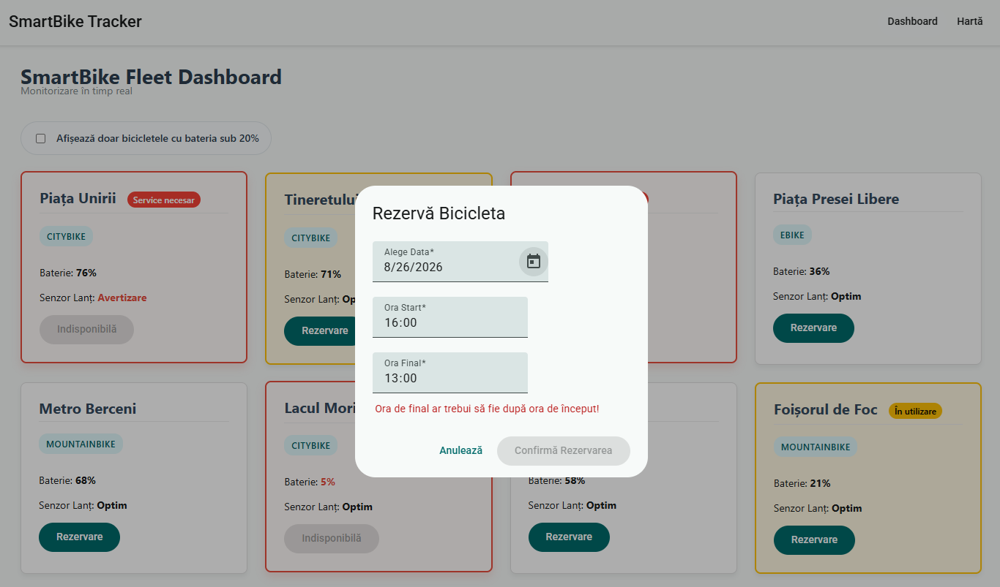
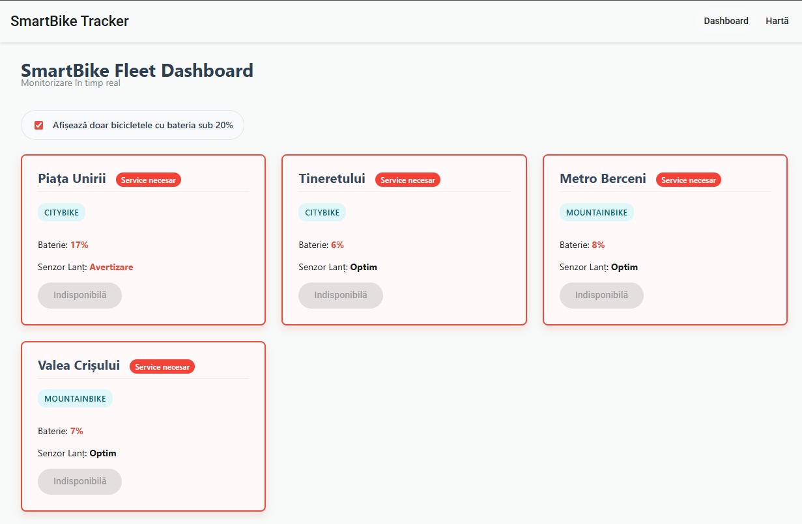

# SmartBike Tracker 🚲

A full-stack Proof of Concept (PoC) designed for the real-time monitoring and management of a smart electric bike fleet. This project showcases a highly scalable integration between a robust **.NET API**, based on **Clean Architecture** and **Domain-Driven Design (DDD)** principles, a PostgreSQL relational database, and a reactive frontend powered by **Angular 17+**.

## 🌟 Features

* **Real-Time Telemetry Simulation:** A built-in `.NET BackgroundService` acts as an IoT simulator, continuously draining battery levels in the database. The Angular frontend uses **RxJS polling** to fetch and animate these changes live every 5 seconds, creating a true real-time dashboard without manual page refreshes.
* **Live State Management (Color-Coded):** Bikes are visually categorized based on their real-time telemetry and booking status:
  * 🔵 **Blue (Available & Normal):** Fully operational, ready to be booked.
  * 🟡 **Yellow (In Use):** Currently booked and out on a ride.
  * 🔴 **Red (Needs Maintenance):** Critical battery level (<20%) or a chain sensor alerting for immediate physical maintenance.
* **Diverse Fleet Support:** System handles multiple models: *EBikes*, *CityBikes*, and *MountainBikes*.
* **Interactive Fleet Map:** A geographical map view, integrated with Leaflet, showing the real-time physical distribution and status of all bikes in the network.
* **Smart Reservation Engine:** A highly secure booking system featuring:
  * Frontend asynchronous overlap validation.
  * Logical time-range validation (Start time must precede End time).
  * Backend *fail-fast* database constraints to prevent double-booking.
* **Dynamic Filtering:** One-click toggle checkbox to isolate and display only bikes requiring an immediate charge (battery < 20%).

## 📸 Screenshots

1. 
    *Dashboard showing bikes in various states: In Use (Yellow), Needs Service (Red), and Available (Blue).*
2. 
    *Geographical distribution of all bikes on the map.*
3. 
    *Trying to access a bike that is currently unavailable.*
4. 
    *Angular Material dialog ready to submit a valid reservation.*
5. 
    *Validation preventing a reservation that overlaps with an existing booking.*
6. 
    *Validation preventing a booking where the end time precedes the start time.*
7. 
    *Dashboard filtered to display only bikes with battery levels below 20%.*

## 🏗️ Architecture Focus: Clean Architecture

This project was intentionally designed to be framework-independent at its core, ensuring maximum maintainability and testability. The backend is decoupled into strict layers:

1. **Domain Layer:** The heart of the software. It uses a **Rich Domain Model** with *Value Objects* (`Battery`, `ChainSensor`) and encapsulates business rules inside the entities (e.g., `bike.UpdateTelemetry()`) rather than relying on anemic data structures with public setters.
2. **Application Layer:** Contains **Use Cases** (e.g., `CreateReservationUseCase`, `SimulateTelemetryDataUseCase`). It defines the `IBikeRepository` interface, ensuring the business logic remains completely ignorant of the database technology.
3. **Infrastructure Layer:** Implements the repositories using **Entity Framework Core**. Changing from PostgreSQL to SQL Server requires zero changes to the Domain or Application layers.
4. **API Layer:** The entry point (Controllers) and background workers (`TelemetrySimulatorService`). It handles HTTP requests, dependency injection setup, and CORS.

## 🛠️ Technologies Used

### Backend (.NET Core)
* C# & ASP.NET Core Web API
* Clean Architecture, Domain-Driven Design (DDD) & Dependency Injection
* Entity Framework Core (Code-First) & PostgreSQL
* `IHostedService` / `BackgroundService` for IoT telemetry simulation
* CORS configured for communication with the frontend

### Frontend (Angular)
* Angular 17+ (Standalone Components, `@if` and `@for` control flow)
* Angular Material (Dialogs, Datepicker, Form Fields)
* Leaflet.js for rendering interactive geographical maps
* RxJS (`BehaviorSubject`, `switchMap`, `timer` for polling)
* SCSS for a modern and responsive interface

## 🗺️ Roadmap (Coming Soon)

* **Global Reservation Calendar:** Integration of `angular-calendar` to visualize all historical and upcoming bookings across the entire fleet in a comprehensive weekly/monthly view.

## 📋 Prerequisites

This project was developed and tested on **Windows (win32 x64)** using the following tool versions:

* **.NET SDK:** 10.0.201
* **Node.js:** 24.18.0
* **npm:** 11.18.0
* **Angular CLI:** 22.0.4
* **PostgreSQL & pgAdmin 4** (for database management)

Make sure you have these versions (or compatible later versions) installed before attempting to run the application.

## 🚀 How to Run the Project Locally

### 1. Database Setup
Ensure your PostgreSQL server is running. Update the connection string in `appsettings.json` if necessary, then apply the migrations:
```bash
cd SmartBikeTracker.Api
dotnet ef database update
```

### 2. Starting the Backend
Navigate to the API folder and run:
```bash
cd SmartBikeTracker.Api
dotnet run
```
The API will start at http://localhost:5009 and the Telemetry Simulator will begin draining batteries automatically.

### 3. Starting the Frontend
In a separate terminal, navigate to the Angular application folder and run:

```bash
cd smart-bike-tracker-ui
npm install
ng serve
```
The application will be available at http://localhost:4200.